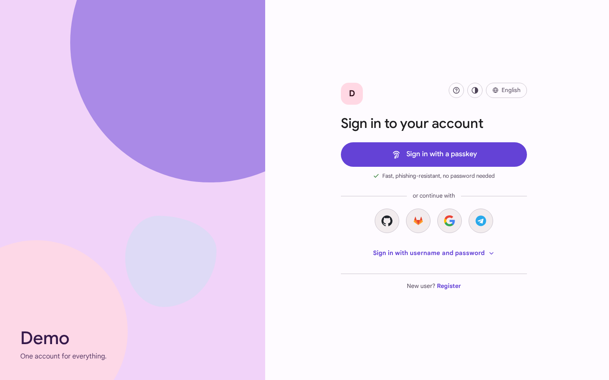
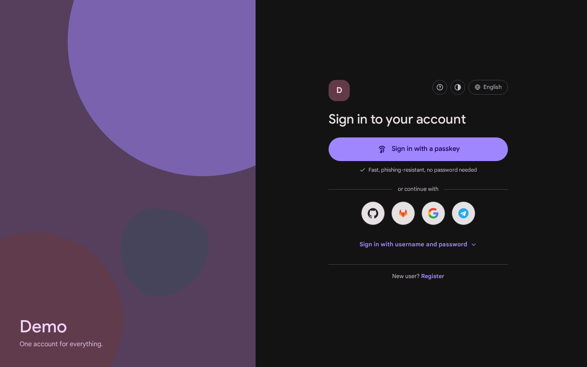
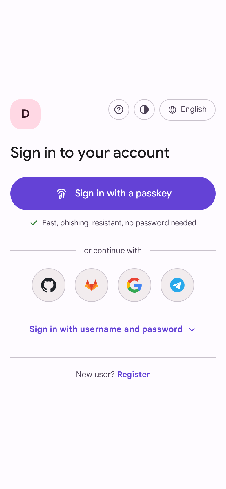
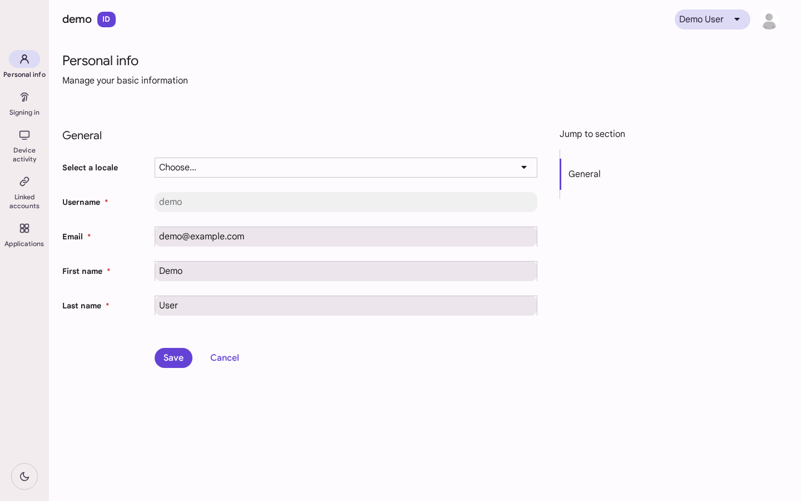
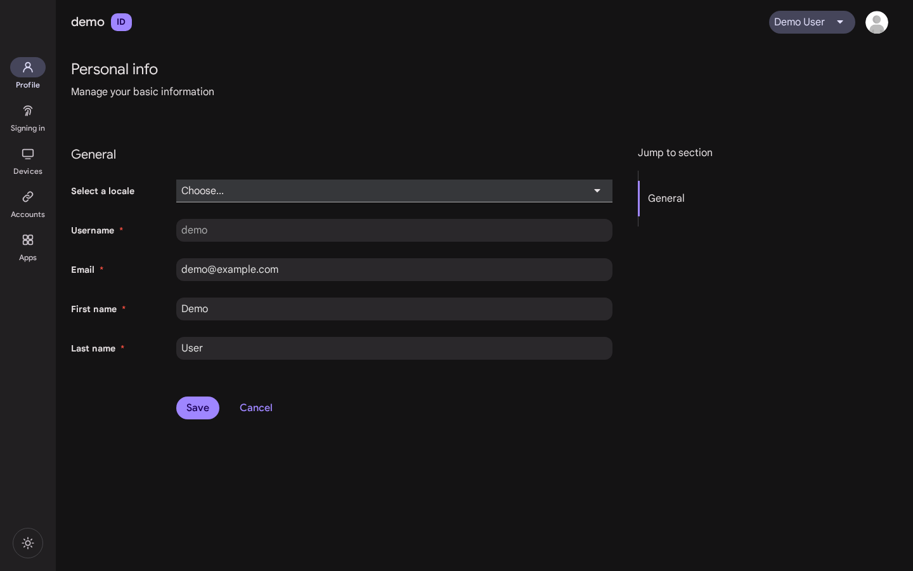

# Keycloak Material 3 Theme

A [Material 3 Expressive](https://m3.material.io/) theme for Keycloak — login pages **and**
Account Console. Passkey-first, responsive, with automatic light/dark mode.

No server rebuild, no JAR packaging, no Keycloakify toolchain: it is a plain theme directory
that you mount into the official Keycloak image.



<p align="center">
  
  
</p>

## Features

- **Passkey-first sign-in** — the passkey button is the single filled (most prominent) button
  on the page; identity providers come second as tonal icon buttons; the username/password
  form is collapsed behind a text button and expands only on demand (or automatically when
  it is the only option, or after a failed attempt).
- **Automatic light / dark theme** via `prefers-color-scheme` — pure CSS, no toggle, no JS.
- **Responsive** — a single centered card on mobile, card plus a decorative brand panel on
  desktop. The brand panel picks up your realm display name.
- **Identity-provider icons** — Google, GitHub, GitLab and Telegram icons ship out of the box,
  matched by provider alias. Adding a provider is one SVG file, no template changes
  ([details below](#identity-provider-icons)).
- **Account Console included** — the same design tokens applied to the `keycloak.v3` Account
  Console (PatternFly variable overrides). The Admin Console is intentionally left untouched.
- **English + Russian** UI strings for the custom elements; all standard strings come from
  Keycloak's own translations, so other locales degrade gracefully.
- **All login flows styled** — registration, password reset, OTP, WebAuthn, `select-authenticator`,
  logout confirmation and error pages inherit the same look through the base theme's
  class hooks.

| Account Console | |
|---|---|
|  |  |

## Compatibility

Developed and tested against **Keycloak 26.3** (quay.io image). The login theme extends the
built-in `base` theme and the account theme extends `keycloak.v3`, so any 26.x should work.
The passkey button relies on the `passkeys` preview feature (see below); without it the theme
still works — the button simply does not render.

## Installation

The theme is a plain directory that ends up mounted at `/opt/keycloak/themes/material3`
inside the official Keycloak image — no `kc.sh build`, no custom Keycloak image. Pick
whichever delivery method fits your setup.

### Option A — theme image (recommended)

The theme ships as a tiny carrier image
(`ghcr.io/nd4y/keycloak-theme-material3`, busybox + theme files, multi-arch). On start it
copies the theme into a shared volume and exits; Keycloak mounts that volume. Nothing to
place on the host — everything comes from registries, and upgrading the theme is
`docker compose pull` + re-deploy:

```yaml
# docker-compose.yml
volumes:
  material3-theme:

services:
  theme:
    image: ghcr.io/nd4y/keycloak-theme-material3:latest
    restart: "no"
    volumes:
      - material3-theme:/target

  keycloak:
    image: quay.io/keycloak/keycloak:26.3
    command: start
    depends_on:
      theme:
        condition: service_completed_successfully
    volumes:
      - material3-theme:/opt/keycloak/themes/material3:ro
    # ... the rest of your configuration
```

Kubernetes — same idea with an init container:

```yaml
initContainers:
  - name: material3-theme
    image: ghcr.io/nd4y/keycloak-theme-material3:latest
    command: ["sh", "-c", "cp -a /theme/material3/. /target/"]
    volumeMounts:
      - { name: material3-theme, mountPath: /target }
containers:
  - name: keycloak
    volumeMounts:
      - { name: material3-theme, mountPath: /opt/keycloak/themes/material3, readOnly: true }
volumes:
  - { name: material3-theme, emptyDir: {} }
```

Tags: `latest` (main branch), `X.Y.Z` / `X.Y` (releases), `sha-<commit>` for pinning.

### Option B — bind-mount the directory

Clone the repo and mount the theme directly:

```yaml
services:
  keycloak:
    image: quay.io/keycloak/keycloak:26.3
    command: start
    volumes:
      - ./keycloak-theme-material3/theme/material3:/opt/keycloak/themes/material3:ro
```

Bare metal: copy `theme/material3` to `/opt/keycloak/themes/material3`.

Then, in the Admin Console for your realm:

1. **Realm settings → Themes**
   - *Login theme* → `material3`
   - *Account theme* → `material3`
   - leave *Admin theme* as is.
2. **Realm settings → Localization** (for the language switcher)
   - *Internationalization* → Enabled
   - *Supported locales* → English, Русский (plus any others)

Themes are cached in production mode; restart Keycloak after updating theme files.

## Enabling the passkey button

The passkey button uses Keycloak's built-in passkeys support (preview in 26.x):

1. Start Keycloak with the feature enabled:

   ```yaml
   environment:
     KC_FEATURES: passkeys
   ```

2. In **Authentication → Policies → WebAuthn Passwordless Policy**:
   - *Enable passkeys* → On
   - recommended: *Requires discoverable credential* → Yes,
     *User verification requirement* → required

3. Let users register a passkey: **Authentication → Required actions** → enable
   *Webauthn Register Passwordless*, or users can add one themselves in the Account Console
   under *Account security → Signing in*.

With the feature active, the login page renders the filled *Sign in with a passkey* button and
also offers passkeys through the browser's username autofill (conditional UI).

## Identity-provider icons

Icons live in
[`theme/material3/login/resources/img/providers/`](theme/material3/login/resources/img/providers/)
and are matched by the **provider alias** in your realm:

```
providers/
  google.svg      ← alias "google"
  github.svg      ← alias "github"
  gitlab.svg      ← alias "gitlab"
  telegram.svg    ← alias "telegram"
  oidc.svg        ← fallback for any alias without its own file
```

To add an icon for a new provider, drop a square SVG named `<alias>.svg` into that directory —
nothing else to change. A provider without an icon automatically falls back to the neutral
key icon (`oidc.svg`).

## Changing the color palette

All colors are CSS custom properties generated from the Material seed color `#6750A4`:

- login: [`theme/material3/login/resources/css/material3.css`](theme/material3/login/resources/css/material3.css) (`--m3-*` tokens, light + dark blocks at the top)
- account: [`theme/material3/account/resources/css/material3-account.css`](theme/material3/account/resources/css/material3-account.css)

To rebrand, generate a palette from your own seed color with the
[Material Theme Builder](https://material-foundation.github.io/material-theme-builder/) and
replace the token values — the layout never references raw colors.

Custom UI strings (button labels, hints) live in
`theme/material3/login/messages/messages_{en,ru}.properties`; add more locales by dropping in
additional `messages_<lang>.properties` files and listing the locale in `theme.properties`.

## Development

A ready-made dev stack with a demo realm (test IdPs, passkeys enabled, `demo`/`demo1234` user):

```bash
docker compose -f dev/docker-compose.dev.yml up
# → http://localhost:8080/realms/demo/account/  (login UI)
# → http://localhost:8080/admin/                (admin/admin)
```

It runs `start-dev` with theme caching disabled, so template and CSS edits apply on refresh.
README screenshots are generated with [`dev/screenshots.py`](dev/screenshots.py) (Playwright).

## License

[MIT](LICENSE) © [nd4y](https://github.com/nd4y)
