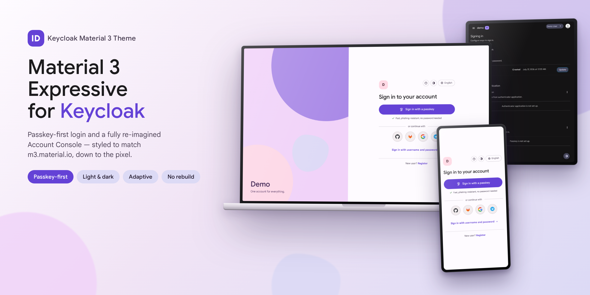

# Keycloak Material 3 Theme

**English** | [Русский](README.ru.md)



A [Material 3 Expressive](https://m3.material.io/) theme for Keycloak covering the login
pages **and** the Account Console. Passkey-first, fully adaptive, automatically light or
dark — and deployable without rebuilding Keycloak: it is a plain theme directory (or a tiny
carrier image) mounted into the official Keycloak image.

## Why this theme

- **Faithful to Material 3 Expressive — down to the pixel.** The color palette, the
  Google Sans type system, the navigation-rail geometry, component shapes and state layers
  are sampled directly from [m3.material.io](https://m3.material.io/), Google's own
  reference implementation, in both light and dark schemes. What you deploy looks like a
  first-party Google product, not an approximation of one.
- **Every interaction is animated.** Card entrances and exits, the expanding password
  section, page transitions in the console, the drawer, hover state layers, even the brand
  panel sliding away as the window narrows — all follow Material's motion system (standard
  easing `cubic-bezier(0.2, 0, 0, 1)`, purposeful durations). Users with
  `prefers-reduced-motion` get an instant, animation-free experience. These guarantees are
  not aspirational: a dedicated motion test suite verifies them in CI on every commit.
- **Passkey-first authentication UX.** The passkey button is the single filled, most
  prominent action; identity providers follow as tonal icon buttons; the username/password
  form stays collapsed until requested (and expands automatically when it is the only
  option or after a failed attempt). Conditional WebAuthn UI is supported.
- **Adaptive on every screen.** The Account Console renders a navigation rail on wide
  screens, collapses into a top bar with a modal drawer on medium ones, and becomes a
  bottom navigation bar on phones — the same responsive behavior as m3.material.io. The
  login page pairs the card with a decorative brand panel on desktop and collapses it
  smoothly on smaller windows.
- **Zero-rebuild deployment.** No `kc.sh build`, no JAR packaging, no Keycloakify
  toolchain, no custom Keycloak image. Mount a directory — or let the published
  multi-arch carrier image populate a shared volume — and switch the realm setting.
- **Nothing installation-specific is hardcoded.** Branding is derived from the realm at
  runtime (realm display name in the masthead and on the login brand panel); strings are
  overridable per realm through Keycloak's standard localization mechanism.
- **Tested like a product, not a stylesheet.** An end-to-end Playwright suite (70+
  assertions: rendering, navigation, theming, i18n, motion, accessibility regressions)
  runs in CI against Keycloak 26.0 and 26.3 before any image is published.
- **Considered details throughout.** A three-mode color-scheme menu (follow the system /
  light / dark) whose choice is shared between login and console; a stable scrollbar
  gutter so pages never shift; an M3 loading indicator that reveals the console only when
  fully assembled; upstream Russian mistranslations of "passkey" corrected; extensible
  identity-provider iconography.

<p align="center">
  
</p>

## Feature overview

- **Both user-facing UIs** — login pages and the `keycloak.v3` Account Console share one
  design system (the Admin Console is deliberately left untouched). All login flows are
  styled: registration, password reset, OTP, WebAuthn, `select-authenticator`, logout
  confirmation and error pages.
- **Typography** — Google Sans / Google Sans Text, loaded from the Google Fonts CDN via a
  single `@import` at the top of each CSS file. If third-party CDNs are not acceptable in
  your environment (privacy / GDPR), delete that line — the theme falls back to
  Roboto/system fonts.
- **Identity-provider icons** — Google, GitHub, GitLab and Telegram ship out of the box,
  matched by provider alias; adding a provider is one SVG file, no template changes
  ([details below](#identity-provider-icons)).
- **Localization** — English and Russian strings for the theme's own UI; every other locale
  gracefully falls back to Keycloak's stock translations.
- **IdP-first onboarding support** — a built-in help dialog explains the
  "sign in with a provider first, add a passkey later" flow to end users, and its text is
  overridable per realm.

| Account Console | |
|---|---|
|  |  |

<p align="center">
  
  
</p>

## Compatibility

Developed and tested against **Keycloak 26.3** (quay.io image). The login theme extends the
built-in `base` theme and the account theme extends `keycloak.v3`, so any 26.x should work.
The passkey button relies on the `passkeys` preview feature (see below); without it the theme
still works — the button simply does not render.

## Installation

The theme is a plain directory that ends up mounted at `/opt/keycloak/themes/material3`
inside the official Keycloak image — no `kc.sh build`, no custom Keycloak image. Pick
whichever delivery method fits your setup.

### Option A — theme image (recommended)

The theme ships as a tiny carrier image
(`ghcr.io/nd4y/keycloak-material3-theme`, busybox + theme files, multi-arch). On start it
copies the theme into a shared volume and exits; Keycloak mounts that volume. Nothing to
place on the host — everything comes from registries, and upgrading the theme is
`docker compose pull` + re-deploy:

```yaml
# docker-compose.yml
volumes:
  material3-theme:

services:
  theme:
    image: ghcr.io/nd4y/keycloak-material3-theme:latest
    restart: "no"
    network_mode: "none"   # it only copies files — no network needed
    volumes:
      - material3-theme:/target

  keycloak:
    image: quay.io/keycloak/keycloak:26.3
    command: start
    depends_on:
      theme:
        condition: service_completed_successfully
    volumes:
      - material3-theme:/opt/keycloak/themes/material3:ro
    # ... the rest of your configuration
```

Kubernetes — same idea with an init container:

```yaml
initContainers:
  - name: material3-theme
    image: ghcr.io/nd4y/keycloak-material3-theme:latest
    command: ["sh", "-c", "cp -a /theme/material3/. /target/"]
    volumeMounts:
      - { name: material3-theme, mountPath: /target }
containers:
  - name: keycloak
    volumeMounts:
      - { name: material3-theme, mountPath: /opt/keycloak/themes/material3, readOnly: true }
volumes:
  - { name: material3-theme, emptyDir: {} }
```

Tags: `latest` (main branch), `X.Y.Z` / `X.Y` (releases), `sha-<commit>` for pinning.

### Option B — bind-mount the directory

Clone the repo and mount the theme directly:

```yaml
services:
  keycloak:
    image: quay.io/keycloak/keycloak:26.3
    command: start
    volumes:
      - ./keycloak-material3-theme/theme/material3:/opt/keycloak/themes/material3:ro
```

Bare metal: copy `theme/material3` to `/opt/keycloak/themes/material3`.

## Configuring Keycloak

Everything below is realm/server configuration — the theme itself needs no build step.

### 1. Switch the realm to the theme

**Realm settings → Themes**:

- *Login theme* → `material3`
- *Account theme* → `material3`
- leave *Admin theme* as is (the Admin Console is intentionally not themed).

Themes are cached in production mode; restart Keycloak after updating theme files
(not needed when only switching the realm setting).

### 2. Localization

**Realm settings → Localization**:

- *Internationalization* → Enabled
- *Supported locales* → English, Русский (plus any others — the theme's own strings exist
  in en/ru; other locales fall back to Keycloak's stock translations)

This also enables the language switcher on the login card.

### 3. Passkeys (the hero button)

The passkey button uses Keycloak's built-in passkeys support (preview in 26.x, needs ≥ 26.2):

1. Start Keycloak with the feature enabled:

   ```yaml
   environment:
     KC_FEATURES: passkeys
   ```

2. **Authentication → Policies → WebAuthn Passwordless Policy**:
   - *Enable passkeys* → On
   - recommended: *Requires discoverable credential* → Yes,
     *User verification requirement* → required

3. Let users register a passkey: **Authentication → Required actions** → enable
   *Webauthn Register Passwordless*, or users add one themselves in the Account Console
   under *Account security → Signing in*.

With the feature active, the login page renders the filled *Sign in with a passkey* button and
also offers passkeys through the browser's username autofill (conditional UI). On older
servers (or with the feature off) the theme degrades gracefully — the button simply is not
rendered. Both the default browser flow and custom flows that keep the standard
*Username Password Form* work.

### 4. Identity providers

Add providers under **Identity providers** as usual. The login page shows one round button
per provider, with icons matched by the provider **alias** (`google`, `github`, `gitlab`,
`telegram` ship out of the box; anything else falls back to a neutral key icon — see
[Identity-provider icons](#identity-provider-icons)).

### 5. Registration model

The theme supports both onboarding styles:

- **Open self-registration**: enable **Realm settings → Login → User registration** — the
  login card shows a "New user? Register" link and a Material-styled registration form.
- **IdP-first onboarding** (no registration form): leave registration off and let accounts
  be created on the first identity-provider sign-in. The login card's **help dialog**
  (the "?" button) explains exactly this to end users: sign in with any listed provider
  first, then optionally set up a passkey or a password (with optional OTP) in the account
  settings.

To reword the help dialog (or any other string) for your realm without forking the theme,
use **Realm settings → Localization → Realm overrides** and override the message keys
`m3HelpTitle`, `m3HelpBody1`, `m3HelpBody2`.

## Identity-provider icons

Icons live in
[`theme/material3/login/resources/img/providers/`](theme/material3/login/resources/img/providers/)
and are matched by the **provider alias** in your realm:

```
providers/
  google.svg      ← alias "google"
  github.svg      ← alias "github"
  gitlab.svg      ← alias "gitlab"
  telegram.svg    ← alias "telegram"
  oidc.svg        ← fallback for any alias without its own file
```

To add an icon for a new provider, drop a square SVG named `<alias>.svg` into that directory —
nothing else to change. A provider without an icon automatically falls back to the neutral
key icon (`oidc.svg`).

## Changing the color palette

All colors are CSS custom properties. The stock values are sampled from
[m3.material.io](https://m3.material.io/) itself (light primary `#6442D6`, dark `#9F86FF`):

- login: [`theme/material3/login/resources/css/material3.css`](theme/material3/login/resources/css/material3.css) (`--m3-*` tokens, light + dark blocks at the top)
- account: [`theme/material3/account/resources/css/material3-account.css`](theme/material3/account/resources/css/material3-account.css)

To rebrand, generate a palette from your own seed color with the
[Material Theme Builder](https://material-foundation.github.io/material-theme-builder/) and
replace the token values — the layout never references raw colors.

Custom UI strings (button labels, hints) live in
`theme/material3/login/messages/messages_{en,ru}.properties`; add more locales by dropping in
additional `messages_<lang>.properties` files and listing the locale in `theme.properties`.

The compact navigation labels in the Account Console (rail, bottom bar, drawer) are the
theme's own keys — `m3NavPersonalInfo`, `m3NavSigningIn`, `m3NavDeviceActivity`,
`m3NavLinkedAccounts`, `m3NavApplications` — and, like any other string, can be
overridden per realm via **Realm settings → Localization → Realm overrides** (page
headings keep their full-length titles either way).

## Development

A ready-made dev stack with a demo realm (test IdPs, passkeys enabled, `demo`/`demo1234` user):

```bash
docker compose -f dev/docker-compose.dev.yml up
# → http://localhost:8080/realms/demo/account/  (login UI)
# → http://localhost:8080/admin/                (admin/admin)
```

It runs `start-dev` with theme caching disabled, so template and CSS edits apply on refresh.
README screenshots are generated with [`dev/screenshots.py`](dev/screenshots.py), the
hero image with [`dev/promo.py`](dev/promo.py), and the motion walkthrough GIF with
[`dev/motion_gif.py`](dev/motion_gif.py) (all Playwright; the GIF also needs ffmpeg).
The e2e suite ([`dev/test_theme.py`](dev/test_theme.py)) — rendering, navigation, theming,
i18n and the motion checks — runs in CI against Keycloak 26.0 and 26.3 before the image is
built.

When releasing a change to CSS or JS, bump the `?v=` query in both `theme.properties` files —
Keycloak's `/resources/<hash>/` URLs change with the server version, not with theme content,
so without the bump browsers keep serving month-old cached assets.

## License

[MIT](LICENSE) © [nd4y](https://github.com/nd4y)
